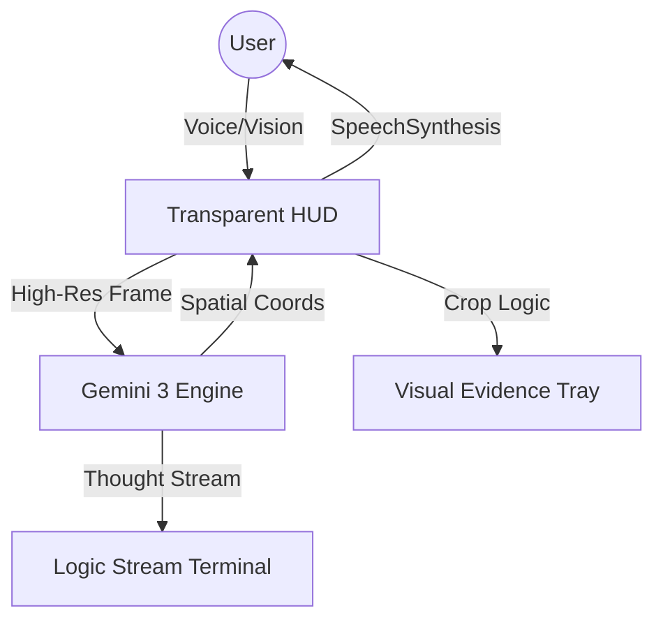

# 💠 PRISM: A JARVIS-Class Spatial HUD
**Perceptive Real-time Integrated System Manager**


> **"PRISM is not a chatbot; it is an extra pair of eyes for the physical world."**

PRISM is a next-generation **Spatial Intelligence HUD** inspired by Iron Man’s *JARVIS and E.D.I.T.H.* It leverages the state-of-the-art multimodal reasoning power of **Gemini 3** to perceive the user’s physical environment through a futuristic Head-Up Display. By bridging computer vision and advanced reasoning, PRISM identifies complex objects, extracts visual evidence, and provides sophisticated,  real-time technical guidance.

---

## 🎥 Video Intro & Demo
[**Watch the Submission Video Here**]  
*(The video features a cinematic Veo awakening sequence followed by a live demonstration of tactical ROI extraction and the logic stream in action.)*

---

## 🚀 Key Features

### 👁️ Tactical ROI Extraction
PRISM doesn't just see—it analyzes. Using Gemini 3’s **High Media Resolution** capabilities, the system detects specific objects and physically "extracts" high-resolution thumbnails from the live camera feed. These are displayed in a "Visual Evidence Tray" for detailed technical inspection, allowing the user to see exactly what the AI is focused on.

### 🧠 Real-time Logic Monologue
Directly exposing the "brain" of the agent, PRISM features an integrated **Neural Logic Stream**. Users can watch the AI's internal reasoning process scroll in real-time within a dedicated terminal window. This provides total transparency into how Gemini 3 identifies objects and evaluates environmental risks.

### 🎯 Dynamic Mission Matrix
Tailor the AI's intelligence to the specific task. PRISM supports multiple **Mission Protocols**, changing its reasoning logic and UI aesthetic based on the selected mode:
*   **Field Repair:** Focused on hardware identification and technical troubleshooting.
*   **Safety Protocol:** Detecting environmental hazards and structural risks.
*   **Wellness Scan:** Analyzing lighting, ergonomics, and environmental health.

### 💎 Stark-Class Holographic UI
A premium **Glassmorphism HUD** built with Tailwind CSS and Framer Motion. Featuring a pulsating Arc-Reactor interaction core, translucent data tiles, and a responsive layout that adapts between mobile and desktop views, PRISM is designed to feel like a piece of specialized hardware from the future.

---

## 🧬 Why Gemini 3?

PRISM was engineered specifically to exploit features unique to the **Gemini 3** model family:

*   **`media_resolution_high`:** Leveraged to achieve the high-precision coordinate detection required for our visual cropping and "evidence extraction" engine.
*   **`thinking_level: low`:** Optimized for human-speed interaction, providing witty, sophisticated verbal responses in near-real-time without the latency typical of high-IQ models.
*   **Structured Output Engine:** Utilizes Gemini 3's advanced JSON schema enforcement to simultaneously return conversational responses, spatial coordinates, and hazard assessments in a single multimodal turn.

---

## 🏗️ System Architecture



## 🛠️ Tech Stack
The Brain: Gemini 3 Flash (Preview) via @google/genai
Frontend: Next.js 15 (App Router, Turbopack)
Styling: Tailwind CSS (Experimental Glassmorphism)
Animations: Framer Motion
Vision: MediaDevices API (Environment Lens)
Audio: Web Speech API (Hands-free STT) & SpeechSynthesis (TTS)

### 📥 Local Setup & Installation
Get PRISM running on your local machine in less than 2 minutes.

1️⃣ Clone the Repository
code
```Bash
git clone https://github.com/PiusKevin3/prism-ai.git
cd prism-ai
```

2️⃣ Install Dependencies
code
```Bash
pnpm install
```

3️⃣ Configure Environment
Create a .env.local file in the root directory and add your Google AI Studio API key:
code
```Bash
Env
GEMINI_API_KEY=your_actual_api_key_here
```
4️⃣ Launch Interface
code
```Bash
pnpm run dev
```

5️⃣ Access PRISM
Open http://localhost:3000 in your browser.
Note: Ensure you grant camera and microphone permissions when prompted to enable the spatial features.

## 🛡️ Hackathon Submission
Category: Machine Learning/AI, Open Ended, Social Good.

### Objective: To redefine the future of AI assistants as Spatial Operating Systems—tools that actively perceive and interact with our physical reality to solve real-world problems.

**"Systems are stable. Standing by for scan, sir."**

Developed for the 2026 Gemini 3 Global Hackathon.